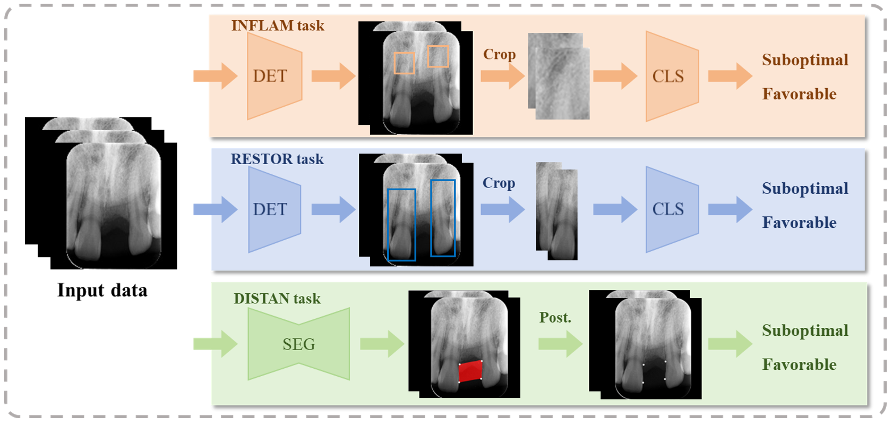

# Deep Learning-Assisted Esthetic Reconstruction from Periapical Radiographs

Periapical radiography can provide multiple key esthetic-determining factors in anterior single-tooth gaps, including inflammation and restoration of adjacent teeth (INFLAM & RESTOR tasks), and the distance between the contact point and the alveolar crest (DISTAN task). 
A multi-functional AI model was developed to assess INFLAM, RESTOR and DISTAN indices in periapical radiography, with corresponding detection, classification and segmentation modules. 
The versatile AI model facilitates precise, objective and reliable prediction of dental implant-supported esthetic reconstruction outcomes, offering valuable support in clinical decision-making and demonstrating potential for real-world application in esthetic dentistry.

## Pipeline

 - INFLAM task (Detection + Classification)
 - RESTOR task (Detection + Classification)
 - DISTAN task (Segmentation)

A case example illustrating the system's application is available in [assets](assets). Please note that it contains RGB images from real patient that some may find unsettling.

## Setup guide
1. Create a conda environment named esthrecon and activate
2. Use conda to install cudatoolkit
3. Install [pytorch](https://pytorch.org/get-started/previous-versions) with suitable python and cuda version
4. Install [mmDetection](https://github.com/open-mmlab/mmdetection) and [nnUNet](https://github.com/MIC-DKFZ/nnUNet) refering their official instructions.
5. Install other packages: 
```
pip install opencv-python pandas pillow scikit-learn tqdm
```